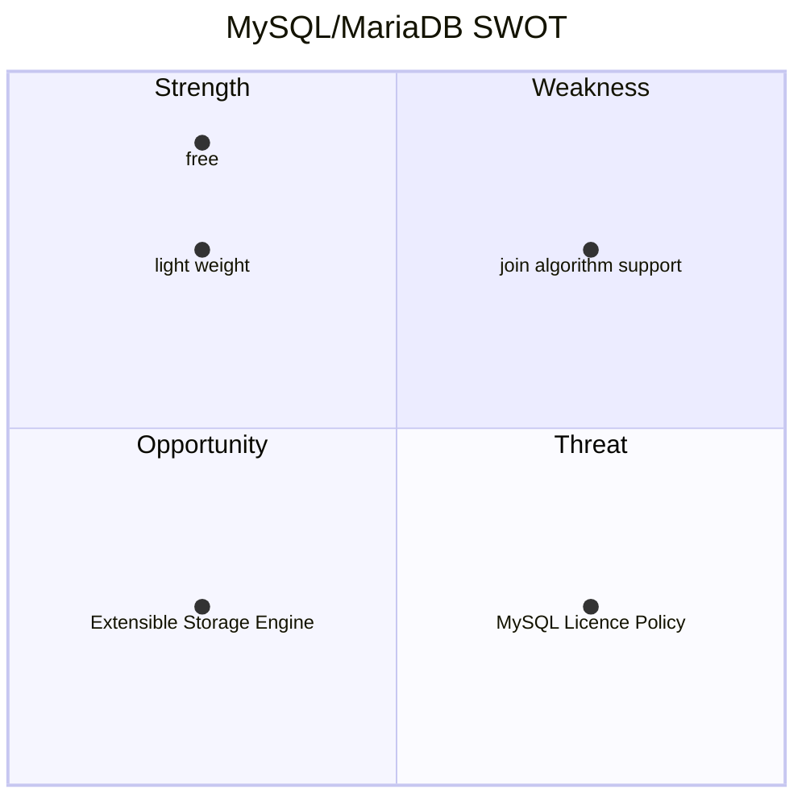

# MySQL과 MariaDB 개요

> 쿼리 튜닝을 위해서 DBMS마다의 구조적 차이를 이해하는 것이 선행되어야합니다. Query offloading을 접목한 시스템 구조에서 슬레이브 노드는 Read와 관련된 작업들을 처리하고, 마스터 노드는 Write와 관련된 작업들을 처리하는데 이를 인지하지 못하고 Write 쿼리에 대한 튜닝을 슬레이브 노드에서 수행한다면 의미가 없기 때문입니다.
이번 포스트에서는 그 중 가장 유명한 DBMS인 Oracle과 MySQL을 비교하며, 쿼리 튜닝에 대한 전반적인 지식을 습득하는 것을 목표로합니다.
{: .prompt-info}

## 상용 DBMS 중 하나인 Oracle과의 차이점?

### 스토리지 측면 비교

MySQL과 MariaDB 그리고 Oracle은 데이터가 저장되는 스토리지 측면에서 큰 차이를 보입니다.

* MySQL
  * 기본적으로 물리적인 DB서버마다 독립적으로 Storage를 할당하여 구성 (shared nothing)
* Oracle
  * 통합된 Storage를 공유하여 사용 (shared everything)

| 분류     | MySQL          | Oracle            | MariaDB        |
| -------- | -------------- | ----------------- | -------------- |
| 아키텍처 | shared nothing | shared everything | shared nothing |

### 조인 알고리즘 비교

* MySQL은 대부분 `중첩 루프 조인(nested loop join)` 방식으로 조인을 수행
* Oracle에서는 `중첩 루프 조인` 뿐만 아니라, `정렬 병합 조인(sort merge join)` , `해시 조인(hash join)` 을 지원
  * 최근에는 `MySQL 8.0.18` 버전 이상에서는 제약적으로 해시 조인을 제공하지만, 대부분은 중첩 루프 조인으로 풀림

| 조인 알고리즘 | MySQL                                 | Oracle                                            |
| - | ------------------------------------- | ------------------------------------------------- |
|               | 중첩 루프 조인 해시 조인(제한적) | 중첩 루프 조인 정렬 병합 조인 해시 조인 |

### 지원 기능 비교

* MySQL은 데이터를 저장하는 `Pluggable Storage Engine` 이라는 개념을 포함하여, 오픈소스 DBMS를 바로 꽂아서 사용할 수 있는 확장성이 특징

  * DBMS의 `plug and play` 기능

  

* 반면에 Oracle은 `pluggable storage engine` 을 지원하지 않음
  * 자체적으로 `통합된 Storage Engine`을 가지고 있으며, 데이터베이스 구조와 기능이 **강하게 결합되어 있음 (tightly coupled)**

| 비교 | MySQL                    | Oracle                |
| ------ | ------------------------ | --------------------- |
| <u>Storage Engine</u> | Pluggable Storage Engine | 통합된 Storage Engine |
| <u>Memory</u> | 메모리 사용률 상대적으로 낮음 | 메모리 사용률 상대적으로 높음 |
| 특화점 | Read중심의 워크로드에 최적화 | 대규모 트랜잭션 처리와 복잡한 쿼리에 최적화, 성능 튜닝 옵션이 多 |
| 캐시 | 8.0버전 이후로 쿼리 캐시가 삭제됨. 이전 버전 또한 단순한 캐시 방식, 복잡한 쿼리 및 동적 데이터 효율성 저하 (**단순, 경량화**) | 더 복잡한 캐시 메커니즘과 다층적인 메모리 관리 기능을 제공 |
| 적합 | 경량 애플리케이션에 적합 (e.g. 웹 애플리케이션) | 비즈니스 크리티컬 애플리케이션에 적합 |

## SWOT 분석

